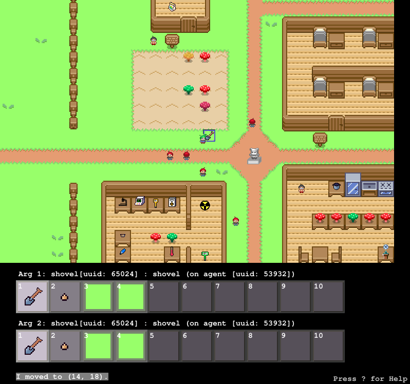
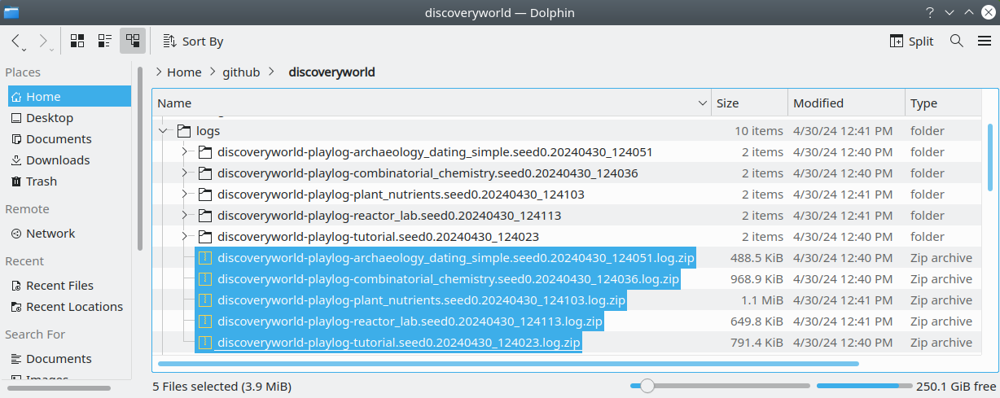

# DiscoveryWorld (User Study Instructions)



DiscoveryWorld is a top-down, turn-based 2D game containing scenarios that model some aspects of scientific discovery.  The purpose is to help benchmark how well AI models can solve tasks that involve discovery scenarios.

The purpose of the user study is to have a control to see how well humans solve these same scenarios.

While we plan to publicly release this game in the next few months, we ask that you do not distribute the experiment materials (including but not limited to the game code for this alpha version) with anyone.

# User study procedure

The procedure for the user study is:
1. Download and install DiscoveryWorld.
2. Play the DiscoveryWorld scenarios.
3. Send the play log files, and any notes you have made.


## Step 1: Installation and Running

### 1.1 Installation

Download DiscoveryWorld (using the link provided to you), and unzip it somewhere you're comfortable with.

Enter the directory:
```
cd discoveryworld
```

Create a conda environment:
```
conda create --name discoveryworld python=3.9
conda activate discoveryworld
```

Install the dependencies:
```
pip install -r requirements.txt
pip install -e .
```


### 1.2 Running

The graphical interface can be run with the following command from the `discoveryworld` root:
```
python scripts/userstudy.py
```

## Step 2: Playing
### 2.1 Tutorial

In order to familiarize yourself with DiscoverWorld, you should complete the first scenario called "Tutorial". In that scenario, you will learn how to move your character around, open containers, manipulate items, interact with devices, and dialog with another character.

*Completing the tutorial is mandatory. While playing it, watch out for a completion code that you need to give to the experimenter.*

### 2.2 Selecting a scenario

DiscoveryWorld contains a number of scenarios, which are shown on a menu when you run the user study.  Currently the scenarios provided below are complete, and the ones we'd like you to work through:
```
Tutorial
Archaeology Dig -- Normal and Challenge
Combinatorial Chemistry -- Normal and Challenge (note that Challenge may take a while)
Plant Nutrients -- Normal and Challenge
Proteomics -- Normal and Challenge
Reactor Lab -- Normal and Challenge
Lost in Translation -- Normal and Challenge
Space Sick -- Normal and Challenge
It's (not) Rocket Science -- Normal (*Challenge* is not yet ready, and should not be played)
```

Scenarios not on this list are not yet complete, and should not be played.

Scenarios can be **played in any order** -- you don't need to start with "Archaeology Dig" first.

### 2.3 Selecting a difficulty and variation

For scenarios with both `Normal` and `Challenge` versions, we would ask that you work through both.

For all scenarios, we ask that you select a task variation of `1` (the first option).

### 2.4 Task Instructions

Upon starting a game, it will present the instructions for your task to you.  These can always be pulled up again by pressing the **TAB** key.

### 2.5 External Tools

Making these discoveries will require methodologically exploring different hypotheses and keeping track of data and your experimental results, just as in real science. You are strongly encouraged to use external tools -- for example, a spreadsheet, and your favorite statistics program.

### 2.6 User Notebook

Please keep a notebook (in a text editor of your choice, as long as it's saved in something we can easily open -- e.g. `.txt`, `.pdf`, `.doc`) where you write down your notes/work in solving each scenario.

**Please treat writing this notebook as a mini (and very brief) lab report.  We would like to know what data you collected, what hypothesis/hypotheses you tested, what solution you came up with, why you think it's correct, and what model(s) or analyses (mathematical or otherwise) you used to arrive at that solution.**

At the start of your notes for a given scenario, please write down the scenario name, difficulty, and variation.  For example:
```
START OF NOTES FOR:
Scenario: Reactor Lab
Difficulty: Normal
Variation: 1
```

Please include a list of any tools you used:
```
TOOLS I USED WHEN SOLVING THIS SCENARIO:
Spreadsheet: Excel
Statistics: R
```

At the end of the notes for a given scenario, it would be helpful if you clearly included your hypothesis for the solution to the task, as well as supporting evidence that lead you to believe the hypothesis can be confirmed:
```
HYPOTHESIS: <Your hypothesis for what the solution to the task is>
SUPPORTING EVIDENCE:
- <a bullet form list>
- <of evidence that you used>
- <to arrive at that hypothesis>
```


### 2.7 Completion

When a game scenario is completed, it will automatically notify you, and then begin saving log files.

If you reach a time limit or decide to quit early, the game will also save log files before you exit.

If you successfully complete a game scenario, it will offer you the opportunity to **play for a bit longer** by pressing **F5**, in case you need to gather a bit more evidence for your notes. 


### 2.8 Trying again

If, for whatever reason, you feel you need to try a scenario again (say, from making an error in your first attempt), you're welcome to.  We ask you to send the log files from each attempt, so we can record that it took multiple attempts to solve successfully. 

### 2.9 Log files

The `userstudy.py` user interface saves extensive logs after each run, including the full game state at each step, the user actions, and frame captures of the game at each step (to assemble a video).  These are stored in the `logs` subdirectory.  A new subdirecty is made each time you play a scenario.  After the log files are saved, the entire log file directory will be automatically archived (zipped up).

### 2.10 Controls

The following controls are supported.  Note that these are also accessible in-game by pressing the `?` key:
* **Arrow keys for movement:** `left/right` keys rotate the agent, `up/down` move forward/backward
* **Arguments:** The objects the agent interacts with are specified by the argument boxes, at the bottom. Use number keys to select specific inventory item of the top argument box, hold shift + number keys for the bottom argument box. Alternatively, `[` and `]` cycle the selection through the top argument box, and `;` and `'` for the bottom argument box.
* **TAB:** View the current task information.
* **Pick up object:** `Space` will attempt to pick up the object in `arg1`
* **Drop object:** `d` will drop the object in `arg1`
* **Put object in container:** `p` will attempt to put the object in `arg1` in the container in `arg2`
* **Give object to another character:** `p` will attempt to give the object in `arg1` to the character in `arg2`
* **Open/Close:** `o` and `c` will attempt to open/close `arg1`
* **Activate/Deactivate:** `a` and *`s`* will attempt to activate/deactivate `arg1`
* **Use:** `u` will attempt to use `arg1` on `arg2` (e.g. use shovel on soil)
* **Talk:** `t` will attempt to talk to the agent in `arg1`
* **Read:** `r` will read the object in `arg1`
* **Eat:** `e` will eat `arg1`
* **Wait:** `w` will do nothing.
* **DiscoveryFeed:** `v` will view the most recent posts on the Discovery Feed.
* **Help:** `?` or `F1` to display help message.
* **Quit:** `ESC` will exit.


## Step 3: Sending play logs

### 3.1 Location of log files

The log files are located in the `/logs/` subdirectory of DiscoveryWorld.

Each time you play a scenario, it will make a new directory for the logs.  When you're finished playing (either by completing the scenario, or stopping playing), it will save the logs.  This may take a minute or two, as the logs can be rather large.  The logs are then ZIPPED up into a single file (per game session you played), to make them easy to transmit.

Note that if you played a scenario more than once (e.g. played the `reactor lab` scenario several times), there will be one ZIP file for each time you played.




### 3.1.1 Contents of log files
The log files contain near-complete recordings of the game state at each turn, to keep track of what objects were present, what actions you took, and how long it took to complete each task.  The logs also contain the renderings (i.e. screenshots) of each frame in the game (in the `/frames/` subdirectory of each log directory).

The log includes the time you started the task, and the amount of time it took to complete the task.

To save space (the logs can be quite large), they are also archived within their respective directories in 100-turn increments.  You're welcome to inspect their contents -- they should be viewable with any text editor that can view large JSON files.

### 3.2 Your notes

Please include the notes you made in the text editor for each scenario.

### 3.3 What we ask you send

Please send:
- The ZIP files for each scenario you played
- The text notes you made for each scenario

## Contact

For any questions, please contact Erin Bransom (erinbransom@allenai.org).
