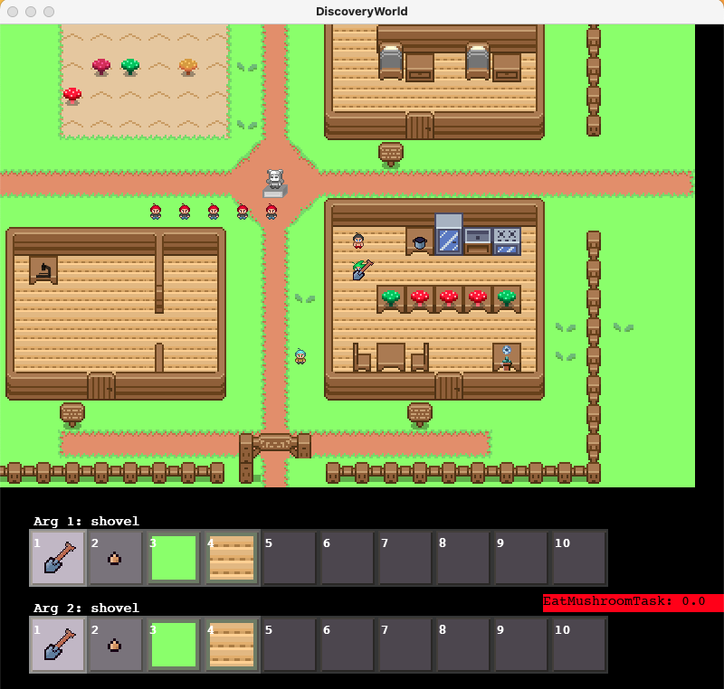

# DiscoveryWorld

This is the repository for DiscoveryWorld (currently under development)



## Installation and Running

### Installation

Clone this repository:
```
git clone https://github.com/allenai/discoveryworld.git
cd discoveryworld
```

Create a conda environment:
```
conda create --name discoveryworld python=3.9
conda activate discoveryworld
```

Install the dependencies:
```
pip install -r requirements.txt
```


### Running

The graphical interface can be run with the following command from the `discoveryworld` root:
```
python src/main.py
```


## Controls

The following controls are supported:
* **Arrow keys for movement:** `left/right` keys rotate the agent, `up/down` move forward/backward
* **Arguments:** The objects the agent interacts with are specified by the argument boxes, at the bottom. `[` and `]` control selection for the top argument box, and `;` and `'` control the bottom argument box.
* **Pick up object:** `Space` will attempt to pick up the object in `arg1`
* **Drop object:** `d` will drop the object in `arg1`
* **Put object in container:** `p` will attempt to put the object in `arg1` in the container in `arg2`
* **Open/Close:** `o` and `c` will attempt to open/close `arg1`
* **Activate/Deactivate:** `a` and *`s`* will attempt to activate/deactivate `arg1`
* **Use:** `u` will attempt to use `arg1` on `arg2` (e.g. use microscope on mushroom)
* **Talk:** `t` will attempt to talk to the agent in `arg1`
* **Read:** `r` will read the object in `arg1`
* **Eat:** `e` will eat `arg1`
* **Wait:** `w` will do nothing. 
* **Quit:** `ESC` will exit.


## Events

This scenario is won by having 10 agents successfully eat non-poisonous mushrooms (which is evidenced by them going about 100 steps after eating a mushroom without getting sick).  If they get sick, you'll notice this by the unhappy face on the agent, and them walking themselves to the infirmary (top-right building). 

Agents can be controlled through dialoging with them:
- Cook: Can ask to (a) collect mushrooms from the farm and put them in the pot, and (b) ask to serve the mushrooms in the pot to the tables.
- Farmer: Can ask to plant more mushroom seeds.
- Colonists: Nominally there will be a mechanic to call the agents to eat -- the hook is there, right now just press "1".

  


## Contact

For any questions, find `Peter Jansen` on Slack (or e-mail `peterj@allenai.org`)
