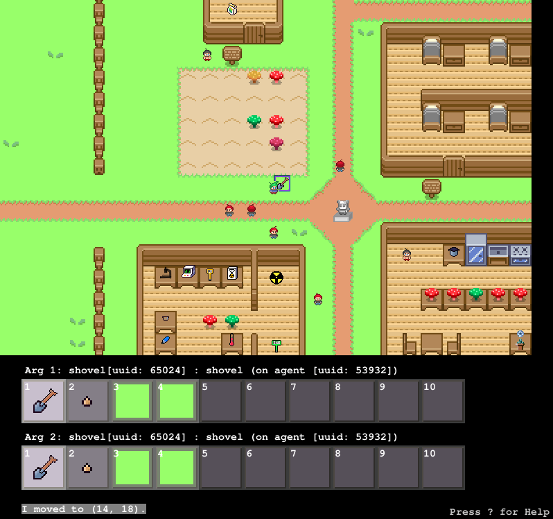

# DiscoveryWorld: A Virtual Environment for Developing and Evaluating Automated Scientific Discovery Agents
NeurIPS Datasets and Benchmarks 2024 (Spotlight)


## Example Agent Video
Below is a short 60 second clip of one of the baseline agents *(Hypothesizer)* attempting a task (Proteomics, Normal Difficulty, Seed 0).  For comparison, a narrated walkthrough of a human playing this same scenario is available on [Youtube](https://www.youtube.com/watch?v=hKWd-pwF0_E).


## 1. Quick Start

### 1.1. I want to read about DiscoveryWorld
The DiscoveryWorld paper (NeurIPS 2024, Spotlight) is available here: [https://openreview.net/forum?id=cDYqckEt6d](https://openreview.net/forum?id=cDYqckEt6d)

A short summary is also available on the [project website](https://allenai.github.io/discoveryworld/).

### 1.2. I want to play DiscoveryWorld using the graphical user interface intended for humans
Installing and running DiscoveryWorld is easy, and generally takes just a few minutes.  To run as a human, please follow the installation instructions in `Section 2` below.

*NOTE: The paper contains spoilers for the DiscoveryWorld tasks.  If you'd like to complete them as the human scientist participants did, without prior knowledge, we would recommend trying the tasks before reading the paper in detail.*

### 1.3. I want to make my own DiscoveryWorld agent, or examine the baseline agents.
The baseline agents are provided in `/agents`, with a special README intended to help you get started quickly, and callout helpful portions of the code that you might be interested in viewing or reusing:
https://github.com/allenai/discoveryworld/tree/main/agents

API documentation is provided below in `Section 3`.

### 1.4. I want to examine the raw data from the agent runs or human runs described in the paper, or see videos of agents playing DiscoveryWorld.
Links to full data releases, including instructions for downloading, as well as their format and other datacard information, is provided in `/data`:
https://github.com/allenai/discoveryworld/tree/main/data

A direct link to a limited archive containing only videos of the baseline agents playing DiscoveryWorld is [available here](https://drive.google.com/file/d/1I34EMVRUIIOppQFX3RueG4Nl75n8_zlJ/view?usp=drive_link).

### 1.5. I want to view the instructions provided to the human scientists when they played DiscoveryWorld.
Please find the instructions provided to the human scientists in `README-USERSTUDY.md`.

### 1.6. I want to see a human scientist playthrough of a DiscoveryWorld task.

Please find a narrated human playthrough of one of the shortest tasks, Proteomics (on Normal difficulty), [available on Youtube](https://www.youtube.com/watch?v=hKWd-pwF0_E).

## 2. Installation and Running

### 2.1. Installation

Clone this repository:
```
git clone https://github.com/allenai/discoveryworld.git
cd discoveryworld
```

Create a conda environment:
```
conda create --name discoveryworld python=3.9
conda activate discoveryworld
```

Install the dependencies:
```
pip install -r requirements.txt
pip install -e .
```


### 2.2. Running the Graphical User Interface

The graphical interface can be run with the following command from the `discoveryworld` root:
```
python scripts/userstudy.py
```

You should see a menu that allows you to select a given scenario theme, difficulty, and parametric seed, followed by the user interface:




### 2.3. Controls

The following controls are supported:
* **Arrow keys for movement:** `left/right` keys rotate the agent, `up/down` move forward/backward
* **Arguments:** The objects the agent interacts with are specified by the argument boxes, at the bottom. Use number keys to select specific inventory item of the top argument box, hold shift + number keys for the bottom argument box. Alternatively, `[` and `]` cycle the selection through the top argument box, and `;` and `'` for the bottom argument box.
* **TAB:** View the current task information.
* **Pick up object:** `Space` will attempt to pick up the object in `arg1`
* **Drop object:** `d` will drop the object in `arg1`
* **Put object in container:** `p` will attempt to put the object in `arg1` in the container in `arg2`
* **Give object to another character:** `p` will attempt to give the object in `arg1` to the character in `arg2`
* **Open/Close:** `o` and `c` will attempt to open/close `arg1`
* **Activate/Deactivate:** `a` and *`s`* will attempt to activate/deactivate `arg1`
* **Use:** `u` will attempt to use `arg1` on `arg2` (e.g. use shovel on soil)
* **Talk:** `t` will attempt to talk to the agent in `arg1`
* **Read:** `r` will read the object in `arg1`
* **Eat:** `e` will eat `arg1`
* **Wait:** `w` will do nothing.
* **DiscoveryFeed:** `v` will view the most recent posts on the Discovery Feed.
* **Help:** `?` or `F1` to display help message.
* **Quit:** `ESC` will exit.


### 2.4. Logging

The `userstudy.py` user interface saves extensive logs after each run, including the full game state at each step, the user actions, and frame captures of the game at each step (to assemble a video).  These are stored in the `logs` subdirectory.


## 3. API Documentation

### 3.1 Philosophy

The API is intended to closely resemble the `OpenAI Gym` API used by many virtual environments, including `TextWorld` and `ScienceWorld`.  The underlying philosophy and workflow of those APIs is:
1. Initialize the API and instantiate an environment
2. Have the agent get an `Observation` (i.e. what it sees at the current time step) from the environment
3. Have the agent provide it's current `Action` (i.e. what it chooses to do, like `eat apple`) at the current timestep
4. Continually repeat steps 3+4 until some exit condition is met, like completing the task, or reaching a maximum number of steps.

The API is described first through minimal agent examples, then through documentation for specific functions.

### 3.2. Minimal Example (Random Agent)

The *Random Baseline Agent*, which randomly selects an action to take at each time step in the environment, is provided as a minimal end-to-end example in the `/agents` folder.

### 3.3. Initializing the API and instantiating a specific world.

Initializing a scenario is performed using the `loadScenario()` function:

```
    api = DiscoveryWorldAPI(threadID=1)
    success = api.loadScenario(scenarioName = scenarioName, difficultyStr = difficultyStr, randomSeed = seed, numUserAgents = 1)
    if (success == False):
        print("Error: Could not load scenario '" + scenarioName + "' with difficulty '" + difficultyStr + "'.")
        return None
```

Note that while DiscoveryWorld was designed to support multiple user agents in a given scenario, this feature is currently untested, and as such `numUserAgents` is set to 1 above.

#### 3.3.1 Scenarios (Task Themes)

A list of recognized task themes can be found here:
```
from discoveryworld.ScenarioMaker import SCENARIO_NAMES
```

#### 3.3.2 Difficulties

A list of recognized difficulties is nominally `Easy`, `Normal`, and `Challenge`, though these can be imported programmatically here:
```
from discoveryworld.ScenarioMaker import SCENARIO_DIFFICULTY_OPTIONS
```

#### 3.3.3 Parametric Variation Seed

The seed is nominally a value between 0 and 4 (i.e. `0, 1, 2, 3, 4`).  Other higher values are possible, and should generate additional parametric variations of a given `{task theme, difficulty}` combination, but are officially outside of the benchmark and unsupported.

#### 3.3.4 Thread ID and Uniqueness

It's important that each concurrently running DiscoveryWorld be given it's own unique `threadID` during initialization.

Internally, the `threadID` is used to create unique output directories for storing the frames of each run.  If you don't wish to have the frames from one run overwritten by another, then your **threadID should be unique across all runs**.

### 3.4. Observation

Observations are provided from the `getAgentObservation()` function, for example:
```
observation = api.getAgentObservation(agentIdx=0)
```

Observations contain the following keys within the `ui` dictionary (in alphabetical order), which can typically be provided directly to an LLM that's able to read JSON-formatted input:
- `accessibleEnvironmentObjects`: A list of objects (and their UUIDs and descriptions) that are close enough to the agent to interact with.
- `agentLocation`: The agent's current world location, the direction it's facing, directions it can move to, and directions that are blocked (nominally, by big objects, like walls).
- `dialog_box`: Information about whether the agent is currently in dialog or not
- `discoveryFeed`: Information about the most recent DiscoveryFeed posts (a Twitter-like environment internal to DiscoveryWorld, and used for some scenarios)
- `extended_action_message`: (Rarely used) This may contain information from text boxes that are provided to the user.
- `inventoryObjects`: A list of objects in the agent's inventory
- `lastActionMessage`: The plain text result of the last action (e.g. `You successfull moved to (16, 5)`).  This is generally identical to the text that the user would see at the bottom of the screen after performing an action.
- `nearbyAgents`: This section lists the recent action history (i.e. within the last few steps) of any agents that are nearby. This can help you understand what other agents are doing, and what they might be planning to do.
- `nearbyObjects`: This section lists objects that are near the agent (i.e. within 3 tiles), including their names, UUIDs, descriptions, and distances.  They are sorted into directions (`north, east, south, west, north-east, north-west, south-east, south-west`) as well as those on the same tile that the agent is standing (`same_location`).  This tends to be, by a wide margin, the largest part of the observation.
- `taskProgress`: Contains the current task description, and whether or not it has been completed.  Critically, no other fine-grained score information (such as the score or subtasks from the scorecard) is available to the agent.
- `world_steps`: The step counter from the environment

For models that can make use of visual information, two images are provided under the `vision` key, encoded in `base64` (that models such as e.g. GPT-4o can use):
- `base64_no_grid`: The 16x24 tile observation of the environment, typically identical to what would be shown in the user interface.
- `base64_with_grid`: As above, but with the grid outline provided.

In addition, an `errors` key is provided in the dictionary, which is empty in normal operation.  If errors are encountered, this may provide helpful additional information.

An example observation return can be found here, for the Dialog unit test:
https://github.com/allenai/discoveryworld/blob/main/doc/example-observation.json


### 3.5. Actions

Actions are performed with the `performAgentAction()` function, which is similar to the `step()` function in the OpenAI Gym API.
```
# Assemble an action packet
actionName = "USE"
actionCommand = {
   "action": actionName,
   "arg1": None,
   "arg2": None
}

# Arguments are the UUIDs of specific objects.  These typically come from the `uuid` field of an object found in the observation
# Here we'll just assume `accessibleObjects` is a list of nearby and accessible objects, taken from the observation, and
# randomly pick two objects from it to serve as arguments.
obj1 = r.choice(accessibleObjects)
actionCommand[arg1] = obj1["uuid"]
obj2 = r.choice(accessibleObjects)
actionCommand[arg1] = obj2["uuid"]

# Perform the action
result = api.performAgentAction(agentIdx=0, actionJSON=actionCommand)
```

#### 3.5.1. What actions are available?

A list of available actions (and, what arguments they expect) is provided through the `listKnownActions()` function.  These actions are specifically formatted such that they can be provided directly in the prompt to LLMs that can read JSON, such as GPT4:
```
actionDescriptions = {
    ActionType.PICKUP.name:         {"args": ["arg1"], "desc": "pick up an object (arg1)"},
    ActionType.DROP.name:           {"args": ["arg1"], "desc": "drop an object (arg1)"},
    ActionType.PUT.name:            {"args": ["arg1", "arg2"], "desc": "put an object (arg1) in/on another object (arg2), or give an object (arg1) to another agent (arg2)"},
    ActionType.OPEN.name:           {"args": ["arg1"], "desc": "open an object (arg1)"},
    ActionType.CLOSE.name:          {"args": ["arg1"], "desc": "close an object (arg1)"},
    ActionType.ACTIVATE.name:       {"args": ["arg1"], "desc": "activate an object (arg1)"},
    ActionType.DEACTIVATE.name:     {"args": ["arg1"], "desc": "deactivate an object (arg1)"},
    ActionType.TALK.name:           {"args": ["arg1"], "desc": "talk to another agent (arg1)"},
    ActionType.EAT.name:            {"args": ["arg1"], "desc": "eat an object (arg1)"},
    ActionType.READ.name:           {"args": ["arg1"], "desc": "read an object (arg1)"},
    ActionType.USE.name:            {"args": ["arg1", "arg2"], "desc": "use an object (arg1), e.g. a thermometer, on another object (arg2), e.g. water."},

    ActionType.MOVE_DIRECTION.name:         {"args": ["arg1"], "desc": "move in a specific direction (arg1), which is one of 'north', 'east', 'south', or 'west'."},
    ActionType.ROTATE_DIRECTION.name:       {"args": ["arg1"], "desc": "rotate to face a specific direction (arg1), which is one of 'north', 'east', 'south', or 'west'."},
    ActionType.TELEPORT_TO_LOCATION.name:   {"args": ["arg1"], "desc": "teleport to a specific location (arg1), by name. A list of valid teleport locations is provided elsewhere."},
    ActionType.TELEPORT_TO_OBJECT.name:     {"args": ["arg1"], "desc": "teleport beside a specific object (arg1). 'arg1' should be the UUID of the object to teleport to."},

    ActionType.DISCOVERY_FEED_GET_UPDATES.name:     {"args": [], "desc": "read the latest status updates on discovery feed"},
    ActionType.DISCOVERY_FEED_GET_POST_BY_ID.name:  {"args": ["arg1"], "desc": "read a specific post on discovery feed (arg1). 'arg1' should be the integer ID of the post."},
}
```


### 3.6. Scoring and Scorecards.

The scorecard provides detailed information about scoring an agent's current performance on a task, and can be accessed using:
```
scorecard = api.getTaskScorecard()
```

A scorecard contains the following keys:
- `taskName`: The internal unique name of this task
- `taskDescription`: The plain-text description of the task
- `completed`: Has the task been completed (regardless of whether it was successful or not)
- `completedSuccessfully`: Has the task been completed successfully? **Used to score task completion**
- `scoreNormalized`: The normalized (0-1) partial progress core.  **Used to score procedural progress**.  Non-normalized scores are also available for internal use (`score` and `maxScore`).
- `scoreCard`: A list of specific subgoals included in the partial progress score, and whether each has been met.
- `criticalQuestions`: A set of binary (yes/no) questions to answer with respect to any notes or other knowledge an agent has accumulated. **Used to score discovery knowledge** (and not applicable for unit tests).

- An additional key, `criticalHypotheses`, exists in the scorecard.  This contains potentially important descriptive knowledge, but was not included in the paper for space.  You may still find it useful in your work.

An example observation return can be found here, for the Dialog unit test:
https://github.com/allenai/discoveryworld/blob/main/doc/example-scorecard.json


### 3.7. Environment `tick()` function (important)

Unlike the OpenAI Gym API, which updates the environment after each call to `step()`, the DiscoveryWorld environment must be manually updated by calling `tick()` after the agent has submitted it's actions using `performAgentAction()`.

```
# Perform the world tick
api.tick()
```

### 3.8. Logging, Frames, Videos

DiscoveryWorld includes an internal function, `api.world.exportWorldHistoryJSON()`, to export a detailed record of the world state at each timestep.

Notes:
- The log files contain essentially everything that can be serialized (including most object properties), for all objects in the entire world grid, for all time steps in the history.
- The log files can be quite large.
- For long runs, the log files may take some time to export
- To prevent single large files, the world history files are split into multiple parts, each containing only 100 steps of world history.  To assemble the full history, you must re-assemble each in turn.  The filenames provide a `partXofY` suffix for indexing.

Example code:
```
    # Example suffix
    logfileSuffix = "any-information-you-prefer-in-your-filename"

    # Save log file
    verboseLogDirectory = "logs/myagent-" + logFileSuffix
    logInfo = {
        "scenarioName": scenarioName,
        "difficulty": difficultyStr,
        "seed": seed,
        "numSteps": numSteps,
        "includeImages": includeImages,
        "exportVideo": exportVideo,
        "threadId": threadId,
        "dateStarted": time.strftime("%Y-%m-%d %H:%M:%S"),
        # Make a verbose filename for the log
        "verboseLogDirectory": verboseLogDirectory,
        "verboseLogFilename": verboseLogDirectory + "/" + "out-myagent-world" + logFileSuffix + ".json",
    }
    # Try to make the 'logs' directory, if it doesn't exist
    try:
        os.makedirs("logs")
    except FileExistsError:
        pass
    # Try to make the full directory
    try:
        os.makedirs(verboseLogDirectory)
    except FileExistsError:
        pass

    print("Saving world history...")
    try:
        api.world.exportWorldHistoryJSON(logInfo, logInfo["verboseLogFilename"], None, None, None)
    # Keyboard/ctrl-c interrupt
    except KeyboardInterrupt:
        print("Keyboard interrupt detected.  Exiting.")
        exit(1)
    # Kill signal
    except SystemExit:
        print("System exit detected.  Exiting.")
        exit(1)
    except Exception as e:
        print("Error saving world history: " + str(e))

```


### 3.9.  Minimal pseudocode LLM agent example

The following is a minimal, nearly complete example agent (with an unimplemented function, `submitLLMPrompt()`, which nominally would call some LLM, that returns a JSON response).

Additional complete examples are provided in the `/agents` folder.

```
from discoveryworld.DiscoveryWorldAPI import DiscoveryWorldAPI
from discoveryworld.ScenarioMaker import SCENARIOS, SCENARIO_DIFFICULTY_OPTIONS

import json

# Given an observation, return an action to take
def model(api, observation, lastActionResult):
    prompt = "You are an agent, and must choose an action to perform a task towards a goal."

    # Add the task description to the prompt
    prompt += "Your task is: \n"
    taskDescription = observation["ui"]["taskProgress"][0]["description"]
    prompt += taskDescription + "\n"

    # Here is what you currently see:
    prompt += "You see: \n"
    prompt += "```json\n"
    prompt += json.dumps(observation["ui"], indent=4, sort_keys=True)
    prompt += "```\n"

    # Here are the actions you can take:
    prompt += "You can take the following actions: \n"
    prompt += "```json\n"
    prompt += json.dumps(api.listKnownActions(limited=False), indent=4, sort_keys=True)
    prompt += "```\n"

    # Teleport: Provide a list of valid teleport locations for this task
    prompt += "Teleporting: To make moving easier, you can teleport to a list of specific locations in the environment, using the teleport action.  In this case, 'arg1' is the name of a location, from the list below. An example teleport action would be: `{\"action\": \"TELEPORT_TO_LOCATION\", \"arg1\": \"school\"}).\n"
    prompt += "```json\n"
    prompt += json.dumps(api.listTeleportLocationsDict(), indent=4, sort_keys=True)
    prompt += "```\n"

    # Result of last action
    prompt += "The result of your last action, which might help inform your next action, is: \n"
    prompt += "```json\n"
    prompt += json.dumps(lastActionResult, indent=4, sort_keys=True)
    prompt += "```\n"

    # Format prompt
    prompt = "\n"
    prompt += "It's now time for you to choose an action.  Please provide a JSON dictionary with your action, below. "
    prompt += "The dictionary should have a key, `action`, and optionally up to two arguments, `arg1` and `arg2`, which are usually each UUIDs of specific objects, unless described differently in the action list.\n"

    # Dialog
    promptDialogStr = ""
    if (api.isAgentInDialog(agentIdx=0)):
        promptDialogStr = "*** NOTE: You are currently in a dialog.  Please ignore the above instructions about choosing an action, and instead choose which option you would like to say in the dialog. ***\n"
        promptDialogStr = "For reference, here is the dialog that you are currently in:\n"
        promptDialogStr += "```json\n"
        dialog = observation["ui"]["dialog_box"]
        promptDialogStr += json.dumps(dialog, indent=4, sort_keys=True)
        promptDialogStr += "```\n"
        promptDialogStr = "The expected response format is JSON, in between code brackets (```), as a dictionary with a single key: `chosen_dialog_option_int` (as well as `memory` and `running_hypothesis`).  The value should be an integer, corresponding to the dialog option you would like to select. You can write prose before the JSON code block, if that helps you think.\n"
    prompt += promptDialogStr


    ## Submit the prompt to the model
    response = submitLLMPrompt(prompt=prompt)   ## TODO: Implement this function

    ## Parse the response into valid JSON
    actionJSON = json.loads(response)
    ## The action JSON is often in the following format:
    # actionJSON = {
    #     "action": "USE",
    #     "arg1": OBJ_UUID1,
    #     "arg2": OBJ_UUID2
    # }

    # Return the action JSON
    return actionJSON


# Example of how to use the DiscoveryWorldAPI to interact with the environment
def exampleLoop(scenarioName, difficultyStr, randomSeed, maxSteps:int=10):
    print("Running example loop.")
    print("Task Theme: " + scenarioName)
    print("Difficulty: " + difficultyStr)
    print("Parametric Seed: " + str(randomSeed))
    print("\n")

    # Load the scenario
    api = DiscoveryWorldAPI(threadID=0)
    success = api.loadScenario(scenarioName = scenarioName, difficultyStr = difficultyStr, randomSeed = randomSeed, numUserAgents = 1)
    if (success == False):
        print("Error: Could not load scenario '" + scenarioName + "' with difficulty '" + difficultyStr + "'.")
        return None

    # Run a loop where we observe the environment, take an action, and repeat.
    lastActionResult = None
    for stepNum in range(0, maxSteps):
        # Print the result
        print("Step " + str(stepNum) + ":")

        # Get the observation from the environment
        observation = api.getAgentObservation(agentIdx=0)

        # TODO: Feed the observation into your model here, and have it generate an action
        actionJSON = model(api, observation, lastActionResult)
        print("Action: " + json.dumps(actionJSON))

        # Take the action
        result = api.performAgentAction(agentIdx=0, actionJSON=actionJSON)
        lastActionResult = result
        print("Result: " + json.dumps(result))
        print("\n")

        # Check if the task is complete
        if (api.areTasksComplete()):
            print("All tasks have been completed.  Exiting.")
            break

    # Show the final score
    scorecard = api.getTaskScorecard()
    print("Scorecard: ")
    print(json.dumps(scorecard, indent=4, sort_keys=True))


#
#   Main
#
if __name__ == "__main__":
    # Set the scenario and difficulty
    scenarioName = SCENARIOS[0]
    difficultyStr = SCENARIO_DIFFICULTY_OPTIONS[0]
    randomSeed = 0

    # Run the example loop
    exampleLoop(scenarioName=scenarioName, difficultyStr=difficultyStr, randomSeed=randomSeed, numSteps=10)
```


## 4. Citation
If you use this work, please reference the following citation:
```
@inproceedings{
    jansen2024discoveryworld,
    title={DiscoveryWorld: A Virtual Environment for Developing and Evaluating Automated Scientific Discovery Agents},
    author={Peter Jansen and Marc-Alexandre C{\^o}t{\'e} and Tushar Khot and Erin Bransom and Bhavana Dalvi Mishra and Bodhisattwa Prasad Majumder and Oyvind Tafjord and Peter Clark},
    booktitle={The Thirty-eight Conference on Neural Information Processing Systems Datasets and Benchmarks Track},
    year={2024},
    url={https://openreview.net/forum?id=cDYqckEt6d}
}
```

## 5. Attribution
DiscoveryWorld makes use of the commercial "CuteRPG World" art asset pack from PixyMoon ( https://pixymoon.itch.io/cute-rpg-world ), which has the following license:
```
License
- You can use it on your project, personal or commercial.
- You can modify and edit it to fit your project.
- Credits to PixyMoon.
- You cannot resell this asset pack!
```

If you release a derivative work of DiscoveryWorld, please support the artist by re-purchasing this art pack for your derivative project.

## 7. License

DiscoveryWorld is released under an Apache 2.0 License.  The text of that license is included in this repository.

The Apache 2.0 license applies only to the DiscoveryWorld code, but does not apply to the [CuteRPG art assets by PixyMoon](https://pixymoon.itch.io/cute-rpg-world), whose license (for example) does permit both modification and personal or commercial use, but prohibits being resold.

## 8. Contact

For any questions, please contact Peter Jansen (`peterj@allenai.org`).  For issues, bugs, or feature requests, please submit a Github Issue.


